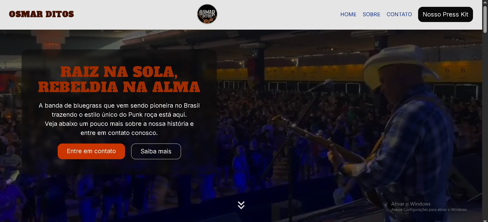
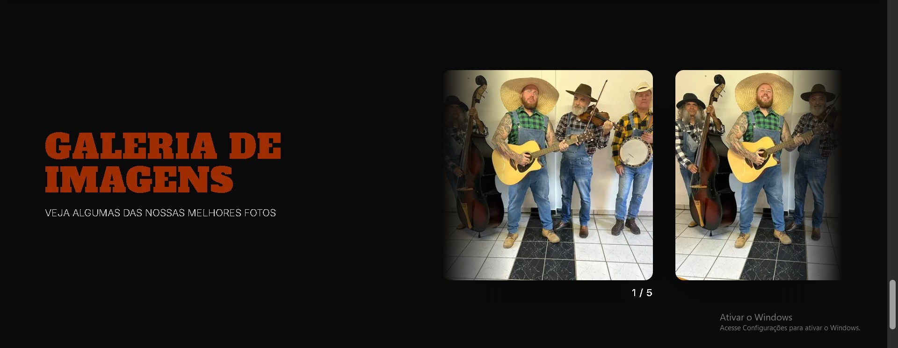

# 🎶 Landing Page - Osmar Ditos  

 
 
 
 
  

Landing page oficial da banda **Osmar Ditos**, desenvolvida para promover o grupo e facilitar a conexão com contratantes e fãs.  
O site reúne informações sobre a história da banda, galeria de fotos, vídeo destaque, links para redes sociais, além de oferecer **download de press kit** e um **formulário de contato** integrado por e-mail.  

🔗 **Acesse em produção:** [landingpage-osmarditos.vercel.app](https://landingpage-osmarditos.vercel.app/)  

---

## 📸 Preview  

> _Adicione aqui screenshots reais do site rodando._  

  
  

---

## 🚀 Tech Stack  

- **Framework:** [Next.js](https://nextjs.org/) (App Router)  
- **Linguagem:** [TypeScript](https://www.typescriptlang.org/)  
- **Estilização:** [Tailwind CSS](https://tailwindcss.com/) + PostCSS  
- **Fonte:** [Geist](https://vercel.com/font) (via `next/font`)  
- **Hospedagem:** [Vercel](https://vercel.com/)  
- **Qualidade de Código:** ESLint  

---

## 📌 Funcionalidades  

- **Sobre** – conheça a história da banda  
- **Vídeo destaque** – embed do clipe mais visualizado  
- **Galeria de fotos** – registros de shows e eventos  
- **Links sociais** – acesso rápido às redes da banda  
- **Formulário de contato** – envia mensagens diretas para o e-mail oficial  
- **Press Kit & Mídia** – disponível para contratantes e jornalistas  

---

## 📂 Estrutura do Projeto  

